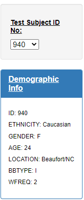
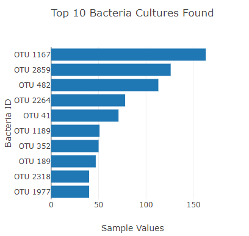
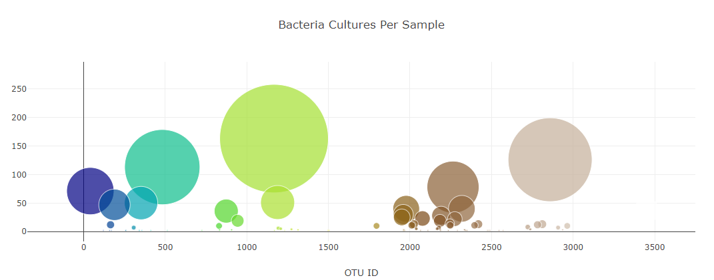
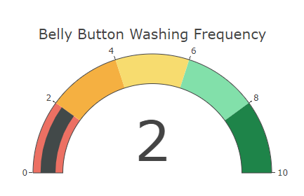

# Belly Button Biodiversity Analysis
## html ,javascript, plotly

**Overview of the analysis:**

In this challenge I am helping a microbiologist named 'Rosa', Rosa's hypothesis is human belly button carry particular type of bacteria that can synthesize protein in a way that taste like beef (not to worry microbes in human navel are harmless), Rosa is trying to identify that single bacterium among the large sample, so they can collaborate with a manufacturer to create synthetic beef from human body bacteria. 

In the past scientists took cells from a cow and, at an institute in the Netherlands, turned them into strips of muscle that they combined to make a patty. Prof Mark Post, of Maastricht University, the scientist behind the burger, remarked: "It's a very good start."

**Dashboard Details:**
 
To help Rosa I have created an interactive chart that can filter and show data for each individual, I have received data in Json format, I have written JavaScript code to read and convert the data to the charts in dashboard. I received 3 sets of data in that json file metadata {}, names {} and samples {}.

I have created a bar chart to show top 10 species of bacteria for a particular individual, 'Test Subject Id no.' represents the person donated microbes’ samples and details related to microbes in their belly button is stored in sample {}, So Rosa can filter each person and check the diversity of the microbes and pick the one she is looking for to create the synthetic beef.Each persons  individual profiles are bacterially unique. Washing frequency can be one important detail that affects what type of bacteria a person carries so to see correlation I have created a guage chart for washing frequency as well.

**Dashboard** [Belly_button_Dashboard](https://reachme1212.github.io/plotlydiploy/)

